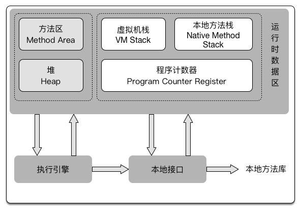
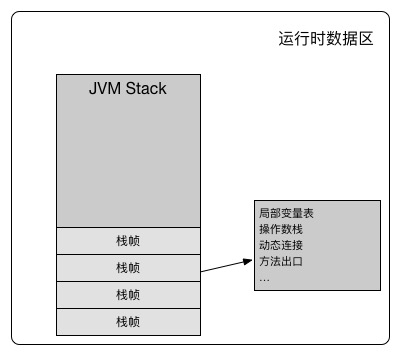

<<深入理解Java虚拟机>>笔记

Java虚拟机在运行Java程序的将所管理的内存分为以下几个数据区域
- 方法区
- 堆
- 虚拟机栈
- 本地方法栈
- 程序计数器

其中方法区和堆栈是有所有线程共享，而虚拟机栈，本地方法栈，程序计数器是线程私有的数据去

###### 程序计数器(PC)
在线程启动的时候创建，大小是一个字长。如果线程正在执行Java方法，计数器记录保存的是下一个将要执行的
指令“地址”。如果线程正在执行本地方法，则保存的值为Undefined

###### Java虚拟机栈
JVM Stack是线程私有的，和线程有相同的生命周期。每个方法在执行是会创建一个栈帧,来存储局部变量表，操
作数栈，动态连接，方法出口等信息。 局部变量表存储了编译期可知的基本数据类型，引用类型和returnAddress类型。局部变量表所需内存空间在编译时已经确定。

如果线程请求的栈空间大于虚拟机允许的最大值，会抛出StackOverflowError。如果JVM stacksh是可以动态
扩展的，但是最后内存还是不够，则会抛出OutOfMemoryError。

###### 本地方法栈
本地方法栈和虚拟机方法栈类似，只不过虚拟机方法栈是为执行Java方法服务，而本地方法栈则是为执行本地方法服务。本地方法栈也可能会抛出StackOverflowError和OutOfMemoryError.

###### 堆
Java堆是所有线程共享的一块内存区域。所有的对象实例和数据都要在堆上分配。堆是垃圾回收器管理的主要区域。
可以通过-Xms和－Xmx来设置堆的初始大小和最大大小。

###### 方法区

方法区是所有线程共享的内存区域。用于存储虚拟机加载的类，常量，静态变量等数据。又被叫做Non-Heap(非堆)
当方法区无法满足内存分配需求时会抛出OutOfMemoryError。

###### 运行时常量池
运行时常量池(Runtime Constant Pool)是方法区的一部分。Class文件除了有类的版本，字段，方法，接口等信息， 还有一项是常量池，用来存放编译时生成的字面量和符号引用，这部分内存在类加载后会进入运行时常量池。 运行时常量池相对于类文件的常量池还具备动态性，在运行期间可以将新的常量放入池中。比如String类的intern()。 当常量池无法在申请到内存时也会抛出OutOfMemoryError。

###### 直接内存
直接内存(Direct Memory)是Java 1.4中加入的NIO使用本地函数库直接分配堆外内存，通过存储在堆中的DirectByteBuffer对象作为这块内存的引用。直接内存不受Java堆大小的限制。
