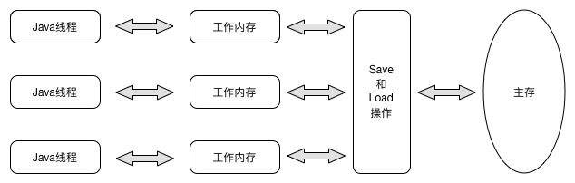
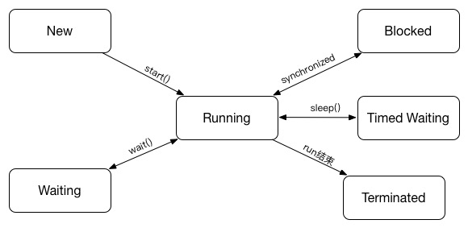

##### Java内存模型与线程

Java虚拟机规范定义了一种Java内存模型(Java Memory Model)来屏蔽掉各种硬件和操作系统的内存访问差异，以实现Java程序在各个平台上一致的内存访问效果。

Java内存模型的主要目标是定义程序中各个变量的访问规则。Java内存模型规定了所有的变量都要存储在主内存中，每条线程有自己的工作内存。线程的工作内存中保存了该线程使用到的变量的主内存副本拷贝。线程对变量的所有操作都必须在工作内存中进行。，而不能直接读写主内存中的变量。不同线程之间也无法直接访问其他线程工作内存中的变量。线程间变量的传递需要通过主存来完成。

 

关机主存和工作内存之间的具体交互协议，即一个变量如何从主存拷贝到工作内存，如果从工作内存同步回主存之类的细节，Java内存模型定义了8种操作来完成，虚拟机必须保证这些操作都是原子的。
- lock  作用于主内存的变量，它把一个变量标识称线程独占的状态。
- unlock 作用于主内存变量，它把一个处于锁定状态的变量释放出来。
- read 作用于主内存变量，它把一个变量从主内存传输到线程的工作线程内，以便以后的load动作使用。
- load 作用于工作内存的变量，它把read操作从主内存中得到的变量值放入工作内存的变量副本中。
- use 作用于工作内存变量。它把工作内存中的一个变量值传递给执行引擎，每当虚拟机遇到一个需要使用到变量值的字节码指令值时将会使用到这个操作。
- assign 作用于工作内存中的变量。，他把一个从执行引擎接收到值赋给工作内存的变量，每当虚拟机遇到一个给变量赋值指令的时候执行这个操作。
- store 作用域工作内存变量，它把工作内存中的一个变量值传递到主内存中，以便随后的write操作使用。
- write  作用于主内存的变量。它把store操作从工作内存中得到的变量值放入主内存的变量中。

如果要把一个变量从主内存复制到工作内存，就需要顺序的执行read和load操作。如果要把变量从工作内存同步回主存，就需要顺序的执行store和write操作。Java内存模型只是要求上述的两个操作必须顺序执行，而没有保证是连续操作。入对主内存中的a,b进行访问是可能出现 read a, read b, load b, load a.Java内存模型还规定了在执行上述8中操作时还要满足如下规则。

- 不允许read和load，store和write操作之一单独出现。即不允许一个变量从主存中读取，工作内存却不接受。或者从工作内存发起了回写，但准存却不接受的情况。
- 不允许一个线程丢弃它最近的assign操作，即变量在工作内存中改变了之后必须把该变化同步回主存
- 不允许一个线程无原因的把数据从工作内存同步回主内存
- 一个新的变量只能在主内存中诞生，不允许在，不允许在工作线程直接使用一个未被初始化的变量。
- 一个变量在同一时间只能有一个线程对其执行lock操作，但是lock操作可以被同一个线程重复执行多次，多次执行lock后，只有执行相同次数的unlock，变量才会被解锁。
- 如果对一个变量执行lock操作，将会清空工作内存中此变量的值。执行引擎使用这个变量前，需要重新执行read和load操作来初始化变量的值。
- 如果一个变量事先没有被lock操作锁定，那就不允许对他执行unlock操作。也不允许去unlock一个被其他线程锁定的变量。
- 对一个操作执行unlock操作执行，必须把此变量的值同步回主存。

当定义一个volatile变量后，它具备两种特性。保证对所有线程的可见性。这里的可见性是指当一个线程修改了变量的值，其他线程可以立即得知。 但是volatile只是保证了可见性，在不符合一下两条规则的运算中，仍然需要加锁来保证原子性。
- 运行结果并不依赖于变量的当前值，或者能够保证只有一个单一的线程修改变量的值。
- 变量不需要与其他的状态变量共同参与不变约束。

volidate的第二个语义是禁止指令重排优化。

####### 先行发生原则(happens-before)

- 程序次序规则(Program order rule)
- 管控锁定规则(Monitor Lock)
- volatile变量规则(Volatile Variable rule)
- 线程启动规则(Thread start rule)
- 线程终止规则(Thread termination rule)
- 线程中断规则(Thread interrupt rule)
- 对象终结规则(Finalizer Rule)
- 传递性(Transitivity)

###### 线程状态转换
Java定义了5种线程状态，任意时间点，一个线程只能有且只有其中的一个状态
- 新建(New) 创建后尚未启动的线程处于这个状态
- 运行(Runnable) Runnable包括了操作系统状态中的Running和Ready。也就是处于此状态的线程有可能正在执行，也有可能正在等待CPU为它分配执行时间。

- 无限期等待(Waiting) 处于这种状态的线程不会被分配CPU时间，他们要等待被其他线程唤醒。以下方法回会让CPU处于无限期等待
没有设置timeout参数的Object.wait方法
没有设置timeout参数的Thread.join方法
LockSupport.park方法
- 限期等待(Timed Waiting) 处于这种状态的线程不会被分配CPU执行时间。不过不需等待其他线程显示的唤醒，在一定事件后他们会有系统自动唤醒。

以下方法会让线程处于限期等待状态
Thread.sleep()
设置来timeout参数的Object.wait()
设置了timeout参数的Thread.join()
LockSupport.ParkNanos()
LockSupport.parkUtil

- 阻塞(Blocked) 线程被阻塞了，阻塞状态和等待状态的区别是  阻塞状态在等待着获取一个排他锁，这个事件将在另外一个线程释放这个锁的时候发生，而等待状态则是在等待一段时间或者唤醒动作发生。线程进入同步去的时候，线程可能进去这个状态。
- 结束(Terminated) 已终止线程的线程状态。

###### 相对线程安全性

相对线程安全保证了对象在单个操作是线程安全的，我们在调用的时候不需要做额外的保障措施，但是对于一些特定顺序的连续调用就可能需要额外的同步手段在调用端来保证调用的正确性

线程安全的实现方法

1. 互斥同步 是一种常见的保证并发正确性的一种手段。同步是指多个线程并发的访问共享的数据时，保证共享的数据在在 同一时刻只被一个或者是一些线程使用。而互斥是实现同步的一种手段。临界区(Critical section), 互斥量(Mutex)，信号量都是主要的互斥实现方式。

 synchronized是Java最基本的实现互斥同步的手段。synchronized在经过编译后，会在同步块的前后生成monitorenter 和monitorexit字节码指令。根据虚拟机规范的要求，在执行monitorenter的时候，需要首先去尝试获取对象的锁。如果对象没有被锁定，或者当前线程已经拥有来该对象的锁，把锁的计数器加1，对应的在monitorexit的时候减1。当计数器为0时，锁就被释放。如果获取锁失败，当前线程就要被阻塞，指令另外一个线程释放锁为止。

 由于Java的线程是映射到操作系统的原生线程之上，如果要阻塞或者唤醒线程，都需要操作系统来帮忙，就需要从用户态转换到核心态中。因此状态转换需要消耗很多的处理器时间。对于简单的同步代码块，可能转换的时间比用户代码的时间要长。所以synchronized是Java中重量级操作。

2. 非阻塞同步 CAS

3. 无同步方案

####### 自旋锁和自适应旋转

由于线程的挂起和恢复有很大的消耗，在许多应用上，共享数据的锁定状态只是持续很短的一段时间，为这段时间去挂起和恢复线程并不划算。如果物理机上有一个以上的处理器，能让两个或以上的线程同时并行执行，我们就可以让后面那个请求锁的线程自己玩一会儿，但是不放弃CPU的执行时间，看看持有锁的线程是否很快就会释放。我们只需要让线程执行一个空循环，这项技术就称为自旋锁。

自旋锁在1.6为默认开启。参数为-XX:+UseSpinning参数来开启。自旋锁并不能代替阻塞，如果锁的占用时间很短，自旋锁的效果会很好，如果很长，则效果就比较差。所以自旋等待的时间必须有一定的限度。如果超过了自旋的次数仍然没有成功获得锁，则应该使用传统的方法挂起线程了。自旋次数默认是10次，可以使用-XX:PreBlockSpin来设置。在1.6中引入了自适应自旋锁。

###### 锁消除
锁消除指虚拟机即时编译器在运行时，对一些代码上对同步要求，但是被检测到不可能存在共享数据竞争的锁进行消除。

###### 锁粗化
我们在编程时，期望同步块的范围尽量小。但是如果一系列连续的操作都是对同一个对象反复加锁和解锁，甚至于加锁的动作处于循环体之中，，如果虚拟机探测到这种情况，会把锁的范围扩展。

###### 轻量级锁
