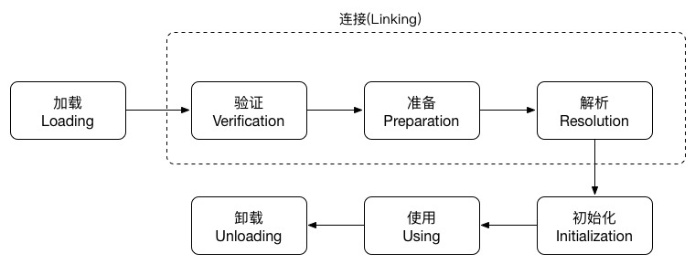
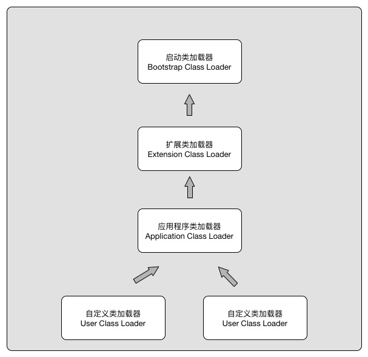
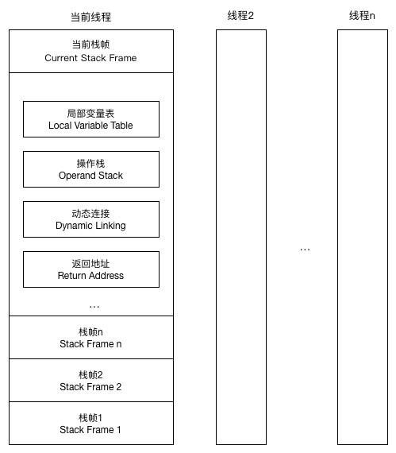

##### Class文件结构
Class文件是以8位字节为基础单位到二进制流，各个数据项目严格按照顺序紧凑的排列在Class文件中，中间没有任何分隔符。当遇到需要占用8位字节以上空间的数据时，咋回按照高位在前的方式分割成若干个8位字节进行存储。
根据虚拟机规范，Class文件采用类似于C语言的结构体的伪结构来存储数据。这个伪结构中只有两种数据类型，无符号数和表。
- 无符号数属于基本的数据类型，以u1,u2,u4,u8分别代表1个字节，2个字节，4个字节和8个字节。无符号数可以用来描述数字，索引引用，数量值或者按照UTF-8进行编码构成的字符串。

- 表是有多个无符号数或者其他表作为数据相构成的复杂数据类型。所有表都习惯性的以_info结尾。表用来描述有层次关系的符合数据结构。

整个Class文件本质上就是一张表，它有下面所示的数据项构成。

|类型|名称|数量|
|-|-|-|
|u4|magic|1|
|u2|minor_version|1|
|u2|major_version|1|
|u2|constant_pool_count|1|
|cp_info|constant_pool|constant_pool_count-1|
|u2|access_flags|1|
|u2|this_class|1|
|u2|super_class|1|
|u2|interfaces_count|1|
|u2|interfaces|interfaces_count|
|u2|fields_count|1|
|field_info|fields|fields_count|
|u2|methods_count|1|
|method_info|methods|methods_count|
|u2|attributes_count|1|
|attribute_info|attributes|attributes_count|

无论是无符号数还是表，当需要描述同一类型但是数量不定的多个数据时，经常会使用一个前置的容量计数器加若干个连续的数据项目的形式，这时称这一系列连续的某一类型的数据为某一类型的集合。

###### 魔数和Class文件的版本
每个Class文件的头4个字节称为魔数(Magic Number)，它的唯一作用就是确定这个文件是否为一个能被虚拟机接收的Class文件。很多文件存储标准中都适用魔数来进行识别。使用魔数而不是文件扩展名主要是处于安全的考虑。Class文件的魔数为 0xCAFEBABE.
紧接着魔数的4个字节存储的是Class文件的版本号(第5，6个字节Mirror Version,第7，8个字节Marjor Version)

###### 常量池
紧接着主版本号的是常量池入口。由于常量池中的数量是不固定的，所以在常量池的入口需要放置一项u2类型的计数器(constant_pool_count).计数器从1开始。 常量池中主要存放两大类型的常量，字面量(Literal)和符号引用(Symbolic References)。

字面量类似于Java语言中的常量概念，如文本字符串，声明为final的常量等。而符号引用则是编译原理等概念。包括下面三类：

- 类和接口等全限定名(Fully Qualified Name)
- 字段等名称和描述符( Descritor)
- 方法等名称和描述符

常量池中的每一项常量都是一个表。

###### 访问标志位

在常量池结束之后，紧接着的两个字节是访问标志位。这个标志用于识别一些类或者接口的访问信息。包括这个Class是接口还是类，是否定义为public，是否定义为abstract类型，是否声明为final等。

####### 类索引，父类索引和接口索引集合

###### 字段表集合

字段表用来描述接口或者类中声明的变量。包括类变量和实例变量。但是不包括方法内声明的局部变量

###### 方法表集合
Class文件中采用的方法的描述和字段的描述符非常类似。依次是访问标志(access_flags),名称索引(name_indexed)，描述符索引(descriptor_index), 属性表集合(attributes)几项。

###### 属性表集合
属性表(attribute_info)，在Class文件中，字段表，方法表都可以携带自己的属性表集合。

#####＃ 字节码指令简介
Java虚拟机的指令由一个字节长度的，代表这某种特定操作含义的数字(称为操作码Opcode)以及紧跟其后的零至多个代表此操作所需参数(操作数，Operrands)而构成。

##### 虚拟机类加载机制
虚拟机把描述类多数据从CLass文件加载到内存，对数据进行校验，转换解析和初始化，最终形成可以被虚拟机直接使用多Java类型，这就是Java虚拟机多类加载机制。

类从被加载到到虚拟机内存开始，到卸载为止，整个生命周期包括：加载(Loading)， 验证(Verifying), 准备(Preparation), 解析(Resolution)，初始化(Initialization), 使用(Using), 卸载(Unloading)7个阶段。
其中验证，准备解析这三个阶段统称为连接(Linking).

对于什么时候开始进行加载，虚拟机规范并没有强制约束，由虚拟机的具体实现自己把握。对于初始化虚拟机规定了有且只有5中情况必须立即对类进行初始化。
- 遇到new getstaic pubstatic 或者 invokespecial这4条字节码指令时，如果类还没有进行初始化，则需要先触发初始化
- 使用java.lang.reflect包的方法对类进行反射调用对时候，如果类还没有初始化，需要先触发初始化
- 当初始化一个类对时候，如果发现其父类还没有进行过初始化，则需要先触发父类对初始化。
- 当虚拟机启动时，用户需要指定一个执行对主类，虚拟机会先初始化这个主类。
- 当使用JDK1.7的动态语言支持时，如果一个java.lang.invoke.MethodHandle实例最后解析结果REF_getstaic,
REF_putStatic, REF_invokeStatic的方法句柄时，并且这个方法句柄对应的类没有进行初始化，则需要先触发其初始化。

这五种场景中的行为称为对一个类进行主动引用，除此之外，所有引用类对方式都不会触发初始化，称为被动引用。

###### 加载

在加载阶段，虚拟机需要完成下面三件事情
1. 通过类对全限定名来获取定义此类对二进制字节流
2. 将二进制字节流所代表对静态存储结构转化为方法区对运行时数据结构
3. 在内存中生成一个代表这个类对Class对象。作为方法区这个类的各种数据的访问入口。

数组类不需要类加载器来创建，他是由Java虚拟机直接创建的。但是数组类和类加载器还是由密切关系的。因为数组类的元素类型是需要类加载器来加载创建的。如果是引用类型的数组，数组类将在加载该元素类型的类加载器的类名空间上被标识。如果不是引用类型虚拟机把数组类与引导类加载器关联。数组类的可见行和元素类型是一致的。非引用类型默认为public。

在加载阶段完成后，虚拟机外部的二进制字节流就会按照虚拟机所需的格式存储在方法区之中，数据存储的格式是由虚拟机实现自行定义的。然后在内存中实例化一个java.lang.Class类的对象(并没有规定要在堆中，对于HotSpot而言，Class对象比较特殊，他虽然是对象，但是却存放在方法区里，作为程序范根方法区中类型数据的外部接口。)

###### 验证
验证是连接阶段的第一步，这一阶段主要是为了保证Class文件的字节流中包含的信息符合当前虚拟机的要求，并且不会危害虚拟机自身的安全。

验证大致会完成下面4个阶段的检验动作。
- 文件格式验证
第一阶段要验证字节流是否符合Class文件格式的规范，并且能被当前版本的虚拟机处理。这个阶段的主要目的是保证输入的字节流能够正确的解析并存储到方法区之中。这个阶段的验证是基础二进制字节流进行的，只有通过这个阶段，字节流才会进入内存的方法去之中，所有后面的验证都是基于方法区存储的数据进行的。

- 元数据验证
第二阶段是对字节码描述信息进行语义分析，保证其描述符合Java语言规范对要求。

- 字节码验证
这个是验证过程中最复杂对一个阶段。主要目的是通过数据流和控制流分析，确定程序对语义是合法对，符合逻辑对。

- 符号引用验证
最后一个阶段对校验是在虚拟机将符合引用转化为直接引用的时候。

###### 准备
准备阶段是正式为类变量分配内存并设置类变量初始值的阶段。这些变量所使用的内存将在方法区分配。这里的初始化在通常情况下是初始化为0值。

###### 解析

解析阶段是虚拟机将常量池内的符号引用替换为直接引用的过程。

- 符号引用(Symbolic Reference)
  符号引用是以一组符号来描述所引用的目标，符号可以是任何形式的字面量。只要使用时能够无歧义定位到目标即可。符号引用与虚拟机实现的内存布局无关，引用的目标并不一定已经加载到内存。各种虚拟机实现的呢称布局可以各不相同，但是他们接受的符号引用必须是一致的。因为符号引用以字面量的形式明确定义在Java虚拟机规范的Class文件中。

- 直接引用(Direct Reference)
直接引用是直接指向目标的指针，相对偏移量或者几个能间接定位到目标的句柄。直接引用和虚拟机的内存布局相关，同一个符号引用在不同的虚拟机实例上翻译出来的直接引用一般不会相同。

###### 初始化
类初始化阶段是类加载的最后一个阶段。到了初始化阶段才真正开始执行Java程序代码。在准备阶段，类变量应赋过一次系统要求的初始值，而在初始化阶段，则会根据Java代码去初始化类变量和其他资源。初始化阶段是执行类构造器<clinit>()方法的过程。

<clinit>()方法是由编译器收集类中所有类变量的赋值动作和静态语句块中的语句合并产生的。收集顺序是语句在原文件中出现的顺序决定的。静态语句块只能访问定义在它之前的变量，定义在它之后的变量，在前面的静态语句块可以赋值，但不能访问。

<clinit>()方法和类的构造函数不同，它不需要显式调用父类的构造器，虚拟机会保证在子类的<clinit>()方法执行之前，父类的<clinit>()方法已经执行完毕。
由于父类的<clinit>()方法先执行，所以父类中定义的静态语句块要先于子类的变量赋值操作。

 <clinit>()方法对于类或者结构并不是必须的，如果类没有静态语句块和变量赋值操作，编译器可以不生成<clinit>()方法。

 虚拟机会保证一个类的<clinit>()方法在多线程环境中被正确的加锁，同步。如果多个线程同时去初始化一个类，那么只有一个线程去执行类的<clinit>()方法，其他线程需要阻塞等待，直到活动线程的<clinit>()方法执行完毕。

###### 类加载器
虚拟机设计团队把 类加载阶段的通过类全限定名获取类的二进制字节流的工作放到了虚拟机的外部去实现，以便应用程序能够自己决定如何去获取所需要的类。 这个工作所对应的代码模块被称为 "类加载器"

对于任何一个类都需要加载它的类加载器和这个类本身一起确定它在Java虚拟机中的唯一性。每个类加载器都有一个独立的类名称空间。

###### 双亲委派模型

从Java虚拟机的角度看，只存在两种不同类型的加载器，启动类加载器(Bootstrap ClassLoader)，有C++语言实现，是虚拟机的一部分，另外就是其他的类加载器。这些类加载器是有Java语言实现的，独立于虚拟机外部，都继承自抽象类java.lang.ClassLoader.

从Java开发程序来看，类加载器可以划分为
- 启动类加载器 这个类加载器负责将放在<JAVA_HOME>/lib目录中，或者被-Xbootclassspath 参数指定的路径中的，并且是虚拟机识别的(仅按照文件名识别，名字不符合的类库，即使放在lib目录下也不会被加载。)类库加载到虚拟机中。启动类加载器无法被Java程序直接使用。用户在编写自定义的类加载器时，如果需要把加载请求委派给启动类加载器，那直接使用null代替即可。

- 扩展类加载器(Extension ClassLoader)  这个类加载器由sun.misc.Launcher$ExtClassLoader实现。它负责加载<JAVA_HOME>/lib/ext目录中的，或者被java.ext.dirs系统变量所指定的路径中的所有类库。开发者可以直接使用扩展类加载器。

- 应用程序类加载器(Application ClassLoader) 这个类加载器由sum.misc.Launcher$AppClassLoader实现。由于这个类加载器是ClassLoader中的getSystemClassLoader()方法的返回值，所以一般称它为系统类加载器。它负责用户类路径(ClassPath)上指定的类库，开发者可以直接使用这个类加载器，如果应用程序没定义过自己的类加载器，他是程序中默认的类加载器。

图中显示的类加载器之间的层次关系，称为类加载器的双薪委派机制(Parents Delegation Model)。双亲委派要求除了顶层的启动类之外，其余的类加载器都应该有自己的父类加载器。这里的类加载之间的父子关系不是以继承的方式来实现，而都是使用组合的方式来复用父加载器的代码。

双亲委派的工作过程：如果一个类加载器收到了类加载的请求， 它首先不会不会自己去尝试加载这个类，而是把这个请求委托给父加载器去完成，每一个层次的类类加载器都是如此，因此所有的加载请求都应该传送到启动类加载器，只有当父类反馈自己无法完成这个加载请求时，子类才会尝试自己去加载。

##### 虚拟机字节执行引擎

######运行时栈帧结构
栈帧(Stack Frame)是用于支持虚拟机进行方法调用和方法执行的数据结构，它是虚拟机运行时数据区中的虚拟机栈的栈元素。栈帧存储了方法的局部变量表，操作数栈，动态连接，方法返回地址等信息。每一个方法的调用开始到执行完毕都对应着一个栈帧在虚拟机中的出栈和入栈。

####### 局部变量表
局部变量表(Local Variable Table)是一组变量值的存储空间。用来存放方法参数和方法内的局部变量。在Java程序编译为Class文件的时候，就在方法的Code属性的max_locals数据相中去定了该方法所需要的局部变量表的最大容量。

局部变量表的容量以变量槽(Variable Slot)为基本单位。 虚拟机使用索引定位的方式使用局部变量表，索引值的范围从0开始至最大的Sol数量。

在方法执行时，虚拟机使用局部变量表来完成参数值到参数变量列表的传递过程的。如果是实例方法，那么局部变量表中的第0个位置用于传递方法所属对象的实例引用。在方法中可以通过this来访问这个隐含的参数。其余参数则按照参数表顺序排列。参数表分配完后，在根据方法内定义的变量顺序和作用域分配其余的Slot。

类变量在经过准备阶段和初始化阶段，即使没有赋值也会有初始值。但是如果定义了局部变量却没有赋值，到出现编译错误。

###### 操作数栈
操作数栈(Operand Stack)也称为操作栈，它是一个LIFO栈。同局部变量表一样，在编译期间其最大深度写入到Code属性到max_stacks数据项中。操作数栈到元素可以是任意到Java数据类型。在方法开始执行到过程中，操作数栈是空到，在方法不断执行到过程中，会有各种字节码指令往操作数栈中写入和读取数据。

例子：
整数加法到字节码指令iadd在运行到时候操作数栈中最接近栈顶到两个元素已经存入类连个int类型的数值，当执行这个指令时会将这两个数出栈并相加，然后结果入栈。

###### 动态连接
每个栈帧都包含一个指向运行时常量池中该栈帧所属方法都引用。拥有这个引用是为了支持方法调用过程中的动态链接(Dynamic Linking)。

###### 方法返回地址

当一个方法开始执行时，只有两个方式退出这个方法。一是执行引擎遇到任意一个方法返回的字节码指令，这时候可能会有返回值传递给上层的调用者。是否有返回值和返回值的类型将根据遇到的何种方法返回指令来决定。这种退出方式称为正常完成出口(Normal Method Invocation Completion)。

另外一种退出方式在方法执行的过程中遇到来异常，并且这个异常没有在方法体内处理，无论是Java虚拟机内部产生的异常还是程序使用athrow指令产生的异常，只要在本方法中的异常表里没有搜索到异常处理器，就会导致方法退出。这种退出称为异常完成出口(Abrupt Method Invocation Completion),这是是不会给上层调用者任何返回值。

在方法退出之后，无论是如何退出，都要返回到方法被调用的位置，程序才能继续执行。方法退出的过程等同于当前栈帧的出栈过程。退出时可能执行的操作: 恢复上层方法的局部变量表和操作栈栈，把返回值压入调用者栈帧的操作数栈，调整PC计数器的值以指向调用者后面的指令。

###### 方法调用

方法调用并等同于方法执行，方法调用阶段唯一的任务就是确定调用方法的版本。在程序运行时方法调用是最普遍和频繁的操作。而Class文件在编译的过程中不包含传统编译中的连接过程，一切方法的调用在Class文件里存储的都是符号引用，而不是方法实际运行时内存布局中的入口。

在类加载的解析阶段，会将其中的一部分符号引用转化为直接引用。如果方法在真正运行之前就有一个可确定的版本，并且这个方法调用版本在运行期间是不可变的。也就是说方法的调用在编译期间就已经确定类。

符合在编译期可知，运行期间不可变的的方法，主要包括静态方法和私有方法这两大类。这两种方法都不可能通过继承或者别的方式重写其他版本。因此他们都适合在类加载阶段进行解析。

在虚拟机中提供了5条方法调用的字节码指令。

- inovkestaic 调用静态方法
- invokespecial 调用实例构造器<init>方法，私有方法和父类方法。
- invokevirutal 调用所有的虚方法
- invokeinterface 调用接口方法，会在运行时在确定一个实现此接口的对象
- invokedynamic 先在运行时动态的解析出调用点限定符所引用的方法，然后在执行该方法。

只要能被invokestatic 和invokespecial指令调用的方法，都可以在解析阶段确定唯一的调用版本。符合这个条件的有静态方法，私有方法，实例构造器，父类方法4类，他们在类加载的时候就会把符号引用直接转换为直接引用。也可以称为非虚方法。其他方法称为虚方法。另外final方法虽然使用invokevirutal指令调用，但是它无法被覆盖，没有其他版本。所以final方法也是非虚方法。

###### 静态分派
