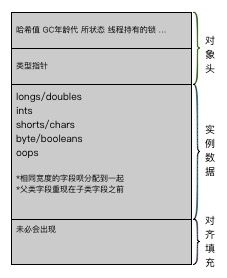
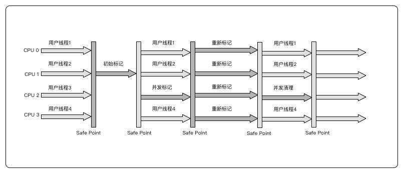

##### Java内存区域

Java虚拟机在运行Java程序的将所管理的内存分为以下几个数据区域
- 方法区
- 堆
- 虚拟机栈
- 本地方法栈
- 程序计数器

其中方法区和堆栈是有所有线程共享，而虚拟机栈，本地方法栈，程序计数器是线程私有的数据去

###### 程序计数器(PC)
在线程启动的时候创建，大小是一个字长。如果线程正在执行Java方法，计数器记录保存的是下一个将要执行的
指令“地址”。如果线程正在执行本地方法，则保存的值为Undefined

###### Java虚拟机栈
JVM Stack是线程私有的，和线程有相同的生命周期。每个方法在执行是会创建一个栈帧,来存储局部变量表，操
作数栈，动态连接，方法出口等信息。 局部变量表存储了编译期可知的基本数据类型，引用类型和returnAddress类型。局部变量表所需内存空间在编译时已经确定。

如果线程请求的栈空间大于虚拟机允许的最大值，会抛出StackOverflowError。如果JVM stacksh是可以动态
扩展的，但是最后内存还是不够，则会抛出OutOfMemoryError。

###### 本地方法栈
本地方法栈和虚拟机方法栈类似，只不过虚拟机方法栈是为执行Java方法服务，而本地方法栈则是为执行本地方法服务。本地方法栈也可能会抛出StackOverflowError和OutOfMemoryError.

###### 堆
Java堆是所有线程共享的一块内存区域。所有的对象实例和数据都要在堆上分配。堆是垃圾回收器管理的主要区域。
可以通过-Xms和－Xmx来设置堆的初始大小和最大大小。

###### 方法区

方法区是所有线程共享的内存区域。用于存储虚拟机加载的类，常量，静态变量等数据。又被叫做Non-Heap(非堆)
当方法区无法满足内存分配需求时会抛出OutOfMemoryError。

###### 运行时常量池
运行时常量池(Runtime Constant Pool)是方法区的一部分。Class文件除了有类的版本，字段，方法，接口等信息， 还有一项是常量池，用来存放编译时生成的字面量和符号引用，这部分内存在类加载后会进入运行时常量池。 运行时常量池相对于类文件的常量池还具备动态性，在运行期间可以将新的常量放入池中。比如String类的intern()。 当常量池无法在申请到内存时也会抛出OutOfMemoryError。

###### 直接内存
直接内存(Direct Memory)是Java 1.4中加入的NIO使用本地函数库直接分配堆外内存，通过存储在堆中的DirectByteBuffer对象作为这块内存的引用。直接内存不受Java堆大小的限制。

###### 对象的创建
在分配内存空间的时候，如果堆中的内存是规整的，可以用指针碰撞的方法，否者就要使用空闲列表的方法。
这也取决于垃圾回收是否会整理内存。

###### 对象的内存布局
对象在内存中的存储可以分为如下图所示的几个区域，对象头，实例数据和对齐填充。

- 对象头 对象头包括两部分信息
  - 第一部分来存储对象自身的运行时数据，如哈希值，GC分代年龄，锁状态，线程持有的锁等。在32/64位虚拟机上也是对应的32/64位。出于对虚拟机空间效率的考虑，对象头被设计成非固定数据结构以便在极小的空间尽可能多的存储信息。
  - 第二部分是类型指针，指向它的类的元数据
  另外如果对象是数组，对象头中还有一块来记录数组的长度
- 实例数据 在相同宽度的字段会被分配到一起的前提下，父类中定义的字段会出现在子类之前。
- 对齐填充 因为Hotspot VM的自动内存管理系统要求对象的起始地址必须是8字节的整数倍。所以对象的大小也就是8字节的整数倍。当实例数据没有对齐时，就需要对齐填充来补全。

######对象定位
在建立对象后，Java程序需要使用栈帧中的reference来访问堆上堆具体对象。目前流行的方法方式有句柄和直接指针

句柄访问的优点是在对象被移动时，只需要改动句柄中的对象实例数据指针。直接指针访问的好处时速度快。

#### 垃圾回收
在程序计数器，虚拟机栈和本地方法栈会随着线程而生，随线程而灭。栈中的栈帧会随着方法的进入和退出执行进栈
和出栈操作，每一帧中分配多少内存在类结构确定下来的时候是已知的，所以在这几个区域在方法结束或者线程结束的时候，内存自然就随着回收了，所以这几个区不需要过多的考虑内存回收的问题。而Java堆区和方法区则不一样，一个接口的多个实现可能需要的内存不一样，我们也只有在程序运行期间才知道需要创建哪些对象，所以这部分的内存是需要动态的分配和回收的。而垃圾回收所关注也是这部分内存。

在堆中存放着Java世界中几乎所有的对象，垃圾回收器在进行回收前，需要判断哪些对象还"活着"，哪些已经"死去"
###### 引用计数算法
引用技术算法(Reference Counting)就是给对象添加一个引用计数器，每当一个地方引用它时，计数器就加1，当引用失效时，计数器就减1.当计数器的值为0时表示对象不再被使用。

但是简单的引用计数器算法很难解决对象间相互引用的问题。

###### 可达分析算法
可达分析(Reachability Analysis) 是来分析对象是否存活的主流实现。算法的基本思路就是通过一系列的
被成为"GC Roots"的对象作为起始点，从这鞋节点开始向下搜索，搜索所走过的路径被成为引用链(ReferenceChain)，
如果以个对象到GC Roots没有任何引用链相连，则证明此对象不可用。

在JVM中可以作为GC Roots的对象包括下面几种
- 虚拟机栈中引用的对象
- 方法区中静态属性引用的对象
- 方法区中常量引用的对象
- 本地方法栈中JNI引用的对象

要宣告一个对象的死亡，至少会经过两次标记过程。在进行可达分析后，如果对象不在引用链中，它将会被第一次标记并且进行一次筛选，
筛选的条件就是该对象是否有必要执行finalize方法。如果该对象没有覆盖finalize方法，或者已经执行过finalize方法，则被视为没必要执行。
如果时有必要执行，则将该对象放入一个叫做F-Queue的队列中，并在稍后由虚拟机启动一个低优先级的Finalizer线程来执行finalized方法。但是这个线程并不保证会等待finalize()运行结束。因为如果finalize()方法执行缓慢或者死循环，将可能导致F-Queue队列中的其他对象处于永久等待的状态，从而导致整个内存回收系统的崩溃状态。稍后垃圾回收器会对F-Queue中的对象进行二次标记，如果对象没有finalize方法中逃脱，则基本上就被回收了。
如果没必要执行，垃圾回收器则对对象进行回收。

###### 引用

无论是引用计数还是可达分析都是通过引用来判断对象是否存活。在JDK1.2之前，引用的定义就是传统意义上的引用。如果reference
类型的数据中存储的是另一块内存的起始地之，我们称之为引用。 这种定义使对象只有引用和没有引用两种状态。

JDK1.2中对引用进行了扩充，将引用分为:
- 强引用(String Reference)
- 软引用(Soft Reference)
- 弱引用(Weak Reference)
- 虚引用(Phantom Reference)

强引用是在代码中普遍存在的引用，比如Object obj = new Object()；对于这类的对象，只要强引用还在，垃圾回收器就不会回收
被引用的对象

软引用是用来描述一些还有用但是并非必须的对象。对于被软引用引用的对象，在系统将要发生内存溢出之前，会把这些对象列入回收范围
并进行二次回收，如果在回收之后还是不能满足要求，才抛出内存溢出异常。在JDK1.2中提供了SoftReference来实现软引用。

弱引用也是用来描述非必需对象的。只是它比软引用更弱一些，被弱引用引用的对象只能生存到下次垃圾回收发生之前。在垃圾回收进行时，
不管内存是否足够，都会回收掉只有弱引用引用的对象。在JDK1.2之后，提供了WeakReference来实现弱引用。

虚引用也称为幻影引用或者幽灵引用，它是最弱的一种引用。一个对象是否有虚引用的存在，完全不影响它的生存时间。也无法通过一个虚引用
来获取一个对象实例。为对象设置一个虚引用的唯一作用就是当这个对象被回收时能够收到一个系统通知。在JDK1.2以后，提供了PhantomReference
来实现虚引用。

###### 回收方法区
方法区(HotSpot中的永久代)的垃圾回收主要回收两部分内容，废弃常量和无用的类。

判断一个类是否无用，需要满足下面的三个条件：
- 该类所有的实例都被回收
- 加载该类的ClassLoader已被回收
- 该类对应的Class对象没有在任何地方被引用。

虚拟机可以对满足这三个条件的类进行回收，但是它不像对象，不用了就必然会回收。是否对类进行回收，虚拟机提供了-Xnoclassgc参数来进行控制。还可以使用-verbose:class和-XX:+TraceClassLoading -XX:+TraceClassUnLoading查看类的加载和卸载信息。前两个可以在Product版本的虚拟机中使用，后者需要FastDebug版虚拟机的支持。

###### 标记－清楚算法
最基础的收集算法是标记－清除(Mark-Sweep)算法。算法分为标记和清除两个阶段。首先会标记出所有需要回收的对象，在标记完之后统一
进行回收。标记算法就是前面提到过的引用计数和可达分析。这种算法存在两个不足：
- 效率问题。标记和清楚两个阶段的效率都不高
- 空间问题。在标记清楚后会产生大量不连续的内存碎片，空间碎片太多导致程序需要分配较大的对象而找不大合适的内存空间时，不得不再次触发垃圾回收动作。

###### 复制算法
为了解决标记－清楚的效率问题，一种称为复制算法出现。它将内存按照容量大小分成两块，每次只使用其中的一块。当其中的一块用完了，就将还存活的对象复制到另一块上。再把之前的那块内存一次清理掉。这使得每次都是对内存的整个半区进行内存回收。在内存分配时不需要考虑内存碎片等情况，只要移动堆顶指针，按顺序分配内存即可。但是这种算法的缺点也很明显，它使可用内存比实际内存缩小了一半。

现代的商业虚拟机基本上都采用了这种算法来回收新生代。IBM的专门研究表明，在新生代中的对象98%都是"朝生夕死"，所以不需要按照1:1的比列来划分内存空间。而是将内存分为一块较大的Eden空间和两块较小的Survivor空间，每次使用Eden和其中的一块Survivor空间。
当需要回收时，将Eden和Survivor中还存活的对象复制到另一块Survivor空间上，最后清理掉刚才使用过的Eden和Survivor空间HotSpot
中默认的Eden和Survivor的大小比例为8:1, 也就是每次新生代中可用的内存空间为整个新生代内存容量的90%，只有10%的空间会被"浪费"。我们没办法保证每次回收的只有不多余10%的存活对象，当Survivor空间不够用时，需要依赖其他内存(老年代)提供分配担保(Handle Promotion).也就是说如果另外一块Survivor空间如果没有足够的空间来保存上一次新生收集存活下来的对象，这些对象将通过担保机制进入老年代。

###### 标记－整理算法
复制收集算法在对象的存活率较高时需要进行较多的复制操作，效率会比较低。如果不想浪费50%的空间，需要有额外的分配担保。所以在老年代不能直接使用这种算法。而需要另外一种标记－整理(Mark-Compact)算法。标记是和标记－清除一样的。但后续阶段不是直接对标记的对象进行清理,而是让所有存活的对象都向一端移动，然后直接清理掉边界以外的内存。

###### 分代收集算法
当前所有的商业虚拟机都采用了分代收集(Generational Collection)算法, 这种算法只是根据对象存活周期的不同，将内存划分成几个
区域。一般把Java堆区分为新生代和老年代，这样就可以根据各个区的特点采用适当的收集算法。

在新生代，每次回收时都会有大量的对象死去，只有少量存活。那就选用复制算法，只需要付出少量存活对象的复制成本就可以完成收集。
老年代中因为对象的存活率高，没有额外的空间进行分配担保，就必须使用标记－清理或者标记－整理的算法。

###### HotSpot的算法实现

HotSpot在实现上面的算法时，必须对算法的执行效率有严格的考量，才能保证虚拟机的高效运行。

以可达分析为例，在从GC Roots节点找引用链的过程中，我们知道可以作为GC Roots的节点主要在全局性的引用和执行上下文中，在很多
应用中，仅方法区就很大，如果要逐个检查其中的应用，那是相当耗时的。 可达分析对时间的敏感性还体现在GC停顿上，因为分析工作必须在一个确保一致性的快照里进行。在执行GC期间，虚拟机必须暂停所有的Java执行线程(Stop the world)。

由于主流的虚拟机都是采用准确式GC，所以当执行系统停顿下来后，并不需要一个不漏的去检查所有执行上下文和全局引用的位置。虚拟机应当有办法直接知道哪些地方存放着对象引用。

在HotSpot中，是使用一组被称为OopMap的数据结构来实现这个目的的。在类加载完成后，HotSpot就把对象内什么偏移量上有什么类型的数据计算出来，在JIT编译过程中，也会在特定的位置记录下栈和寄存器中哪些位置是引用。这样GC在扫描时就可以得知这些信息了。

在程序执行的过程中，并不是所有的地方都能够停顿下来进行GC,只有在一些特定的位置才能暂停，这些位置被称为安全点(SafePoint)
安全点的位置可以是：
- 方法临返回前／调用方法的call指令后
- 循环的末尾
- 可能抛出异常的位置

安全区域(Safe Region)

安全区域是为了处理一些储蓄不执行状态的时，比如线程处于Sleep或者Blocked状态，这时候时没法响应JVM的中断请求，执行到安全点挂起的。对于这种情况，就需要安全区域来解决。安全区域是指在一段代码片段中引用关系不会发生变化，在这段代码中的任何地方开始GC都是安全的。当线程执行到Safe Region中时，会首先标示自己已经进入Safe Region,那样当在这段时间里JVM要发起GC时，就不用管处于Safe Region的线程了。如果线程在离开Safe Region时，他要检查系统是否已经完成了跟节点的枚举，如果完成则线程就继续执行，如果没有这就需要等待知道收到可以安全离开Safe Region的信号为止。

##### 垃圾收集器
HotSpot虚拟机中包含的垃圾收集器

###### Serial收集器
Serial收集器时最基本，历史最悠久的收集器。他是一个单线程的收集器，只会使用一个收集线程来完成垃圾收集工作。在它进行垃圾收集时
必须暂停其他所有工作的线程，直到它收集结束。

###### ParNew收集器
ParNew收集器就是Serial收集器的多线程版本。ParNew除了多线程收集外，其他和Serial相比，并没有太多创新。但是它却是运行在Server模式下虚拟机中首选的新生代收集器，其中一个重要的原因时，除了Serial收集器外，只有它能够与CMS收集器配合工作。

##### Parallel Scavenge收集器
Parallel Scanvenge收集器时一个新生代收集器，他也是使用的复制算法。又是并行的多线程收集器。Parallel Scavenge 收集器的关注点和其他收集器不同，CMS等收集器的关注点主要在尽可能的缩短垃圾收集时用户线程的停顿，而Parallel Scavenge的目的是达到一个可控的吞吐量。所谓的吞吐量＝运行用户代码的时间/(运行用户代码的时间＋垃圾回收的时间)

停顿时间越短就越适合与用户交互的程序，良好的响应能够提高用户体验。而高吞吐量则可以高效的利用CPU的时间，尽快的完成程序的运算任务。主要适合后台运算而不需要太多交互的任务。

Parallel Scanvenge提供了两个参数来精确的控制吞吐量。分别是控制最大垃圾收集停顿时间的-XX:MaxGCPauseMills和直接设置吞吐量大小的-XX:GCTimeRatio.

-XX:MaxGCPauseMills允许的值是大于0的毫秒数。收集器尽可能的保证花费的时间不超过设定值。但是并不是把这个值设置的小一点就能是垃圾回收的速度变得更快。GC的停顿时间缩小吞吐量和新生代的空间换来的。系统会把新生代空间调小一点，这就直接导致垃圾回收会更频繁。停顿时间下降，但是吞吐量也会下降。

-XX:GCTimeRatio参数的值应当是个大于0小于100的整数。是程序运行时间和垃圾回收时间的比率。GC的时间占比为1/(1+N).默认值为99.即1/(1+99)=1%.
由于和吞吐量有密切的关系，所以Parallel Scavenge也被称为吞吐量优先的收集器。
Parallel Scavenge还有一个参数-XX:UseAdaptiveSizePolicy，这是一个开关参数，当这个参数打开时，就不需要手工设置新生代的大小(-Xmn)和Eden和Survivor区的比例，已经晋升老年代对象大小(-XX:PretenureSizeTHreshold)等细节参数了。虚拟机会根据当前系统运行情况收集性能监控信息，动态的调整这鞋参数以提供最合适的停顿时间活着最大的吞吐量。这称为GC自适应调节策略。 如果对参数不太熟悉，
只需要制定-XX:MaxGCPauseMills或者-XX:GCTimeRatio给虚拟机设置一个优化目标，其他参数由虚拟机自定完成。自适应策略也是Parallel Scavenge和ParNew的一个重要区别。

###### Serial Old收集器
Serial Old时Serial收集器的老年代版本。使用的是标记－整理算法。这个收集器主要是给Client模式下的虚拟机使用。在Server模式下，主要有两个用途，一个是在JDK1.5及以前的版本中与Parallel Scavenge收集器搭配使用。另一种就是作为CMS的后备预案，在并发收集器遇到Concurrent Mode Failure时使用。

###### Parallel Old收集器
Parallel Old收集器是Parallel Scavenge收集器的老年代版本。使用多线程和标记整理算法。这个收集器是在JDK1.6里面开始提供。

 

 ###### CMS收集器

 CMS(Concurrent Mark Sweep)收集器是以获取最短停顿时间为目标的收集器。目前大部分的Java应用集中在互联网或者B/S架构的服务端上，这种应用注重的是响应速度，希望系统停顿的时间最短，以带来更好的用户体验。CMS就非常符合这类需求。

CMS是基于标记－清除的算法实现的。它的运作过程比前面提到的几个收集器要复杂一些，整个过程分为4个阶段
- 初始标记(CMS initial mark)
- 并发标记(CMS concurrent mark)
- 重新标记(CMS remark)
- 并发清除(CMS concurrent sweep)

其中初始标记，重现标记两个阶段仍需要"Stop the world"。初始标记只是标记一下GC Roots能够直接关联
到的对象。速度很快。并发标记阶段就是进行GC Roots Trancing的过程。而在重新标记阶段则是为了修正并发
标记期间因用户线程继续运行而导致标记产生变动的那一部分对象的标记记录。这一阶段停顿的时间会比初始标记稍长，但远比并发标记时间短。
而由于耗时时间最长的并发标记和并发清除都可以和用户线程一起工作，所以从总体上来讲CMS收集器的内存回收过程是和用户线程一起并发执行的。

CMS也有一下几个缺点

CMS收集器对CPU资源非常敏感。在并发阶段虽然不会导致用户线程停顿，但是会占用一部分CPU资源导致用户程序变慢。CMS默认启动的回收线程数是(CPU数量+3)/4, 当CPU大于4个时，并发回收时有不少于25%的CPU占用。并随着CPU数量的增加而减少。当CPU的数量不足4个时，CMS对用户程序的影响可能会变大。

CMS无法处理浮动垃圾(Floating Garbage), 可能出现Concurrent Mode Failure而导致另一次Full GC的产生。由于在CMS在并发清理阶段用户线程还在运行，就会产生新的垃圾，这部分垃圾是出现在标记之后，不会被清理掉。只能等到下一次GC的时候才能清理。这一部分垃圾就称为浮动垃圾。由于在垃圾清理阶段用户程序还在运行，就需要留出足够的内存空间给用户线程使用。因此CMS不能像其他收集器一样，等到老年代几乎被填满的时候再来收集。在JDK1.5中默人配置中，CMS收集器当老年代使用了68%的时候就会被激活。这是一个偏保守的设置。可以通过-XX:CMSInitiatingOccupancyFraction值来提高触发百分比，来降低内存回收次数。在JDK1.6中以提高到92%。如果在CMS运行期间，预留的内存无法满足程序的要求，就会出现一次Concurrent Mode Failure. 这时虚拟机会启动后预案。临时启动Serial Old收集器来重新进行老年代的回收。

CMS是基于标记－清除算法来实现垃圾回收的。所以会产生大量的空间碎片。碎片过多时，就会对大对象的分配带来问题。会出现明明老年代的空间还有很多，但是就是找不到合适的连续空间来非配当前的对象。不得不提前触发一次Full GC。为了解决这个问题，CMS提供了-XX:+UseCMSCompactAtFullCollection开关参数(默认开启)用户在CMS收集器顶不住要进行Full GC时候开启内存碎片的整理工作。内存整理是没有办法并发的，所以虽然解决了碎片问题，但是停顿时间就会变长。虚拟机还停工了另外一个参数-XX:CMSFullGCsBeforeCompaction来设置在执行多少次不压缩的Full GC后跟着来一次内存的压缩整理。
(默认是0，也就是每次都会进行压缩整理。)

###### G1收集器
G1(Garbage First)收集器是当今收集器发展最前沿的成果之一。G1是一款面向服务端应用的垃圾回收器。
G1收集器有如下特点：
- 并行与并发 G1能够充分利用多CPU的硬件优势，使用多个CPU来缩短Stop The World时间。
- 分代收集 与其他收集器一样，G1中仍然有分代收集。G1收集器可以需要其他收集器的配合就能管理整个GC堆。但是它能够采取不同的方式来处理新创建的对象和已经存活了一段时间的对象。
- 可预测的停顿 这是G1相对于CMS的一大优势。降低停顿时间是G1和GMS的共同关注点。除此之外，G1还能建立可
预测的停顿时间模型。能让使用者在一个长度为M毫秒的时间段内，消耗在垃圾收集上的时间不超过N毫秒。

G1之前的收集器进行收集的范围都是整个新生代或者老年代。而G1不再是这样。它将整个Java堆划分为多个大小
相等的独立区域，虽然依然保留了新生代和老年代的概念，但是他们不在是物理上隔离的了，他们都是一部分区域的集合。

G1收集器之所以能够建立可预测的停顿时间模型，是因为它可以有计划的避免在整个堆中进行全区域的垃圾收集。
G1会跟踪各个Region里面垃圾堆积的价值大小(回收所获得的空间大小及回收所需要的时间的经验值)。在后台维护一个优先列表，优先来回收价值最大的Region。

为了解决不同Region间对象相互引用的问题，虚拟机是通过Remembered Set来避免全堆扫描的。G1中每个Region都有一个对象的Remembered Set，当虚拟机发现程序堆Reference类型的数据进行写操作时，检查Reference引用的对象是否处于不同的Region中，如果是，就把相关的引用信息记录到Remembered Set中。
在进行内存回收时，在GC Roots的枚举范围中加入Remembered Set即可保证不对堆进行全扫描。

G1收集器大概分为几个阶段：
- 初始标记(Initial Marking)
- 并发标记(Concurrent Marking)
- 最终标记(Final Marking)
- 筛选回收(Live Data Counting and Evacuation)

###### 垃圾收集器参数总结
|  参数 | 描述  |
|---|---|
| UseSerialGC  |虚拟机运行在Client模式下的默认值，打开此开关后使用Serial+Serial Old的收集组合器进行回收  |
| UseParNewGC  |打开此开关后，使用ParNew+Serial Old的组合进行内存回收  |
| UseConcMarkSweepGC  |打开此开关后，使用ParNew+CMS+Serial Old组合进行内存回收。Serial Old作为CMS 出现Concurrent Mode Failure失败后的后备收集器使用   |
| UseParallelGC  |虚拟机在Server模式下的默认值。打开此开关后，使用Parallel Scanvenge＋Serial Old收集器进行内存回收   |
| UseParallelOldGC  |打开此开关后，使用Parallel Scanvenge + Parallel Old组合进行内存回收  |
| SurvivorRatio  |新生代中Eden和Survivor区域的容量比例。默认值为8，代表Eden:Survivor=8:1   |
| PretenureSizeThreshold  |直接晋升老年代的对象大小，设置此参数后，大于这个参数的对象直接在老年代分配   |
| MaxTenuringThreshold  |晋升到老年代的对象年龄。每个对象在坚持过一次Mirror GC后，年龄就会增加1，当超过这个参数值时，就进入老年代   |
| UseAdaptiveSizePolicy  |动态调整Java堆中各个区的大小和进入老年代的年龄。   |
| HandlePromotionFailure  |是否允许分配担保策略。即老年代的剩余空间不足以应对新生代的整个Eden和Survivor中所有对象都存活的极端情况   |
| ParallelGCThreads  |设置并行GC时进行内存回收的线程数   |
| GCTimeRatio  |GC时间占总时间的比率。默认值为99.即允许1％的GC时间。只有在Parallel Scavenge收集器上才有效   |
| MaxGCPauseMills  |设置GC的最大停顿时间。只有在使用Parallel Scavenge的时候才有效。   |
| CMSInitiatingOccupancyFraction  |设置CMS收集器在完成垃圾回收后是否要进行一次内存碎片整理，尽在CMS收集器时有效   |
| CMSFullGCsBeforeCompaction  |  设置CMS收集器在进行若干次垃圾回收后再启动一次内存碎片整理。默认值为0.仅在CMS收集器有效。 |

###### GC日志
如果要查看GC日志，可以在启动java程序的时候加入参数来打印日志到控制台或者文件。
- -XX:+PrintGC 输入GC日志
- -XX:+PrintGCDetails 输出GC的详细日志
- -XX:+PrintGCTimeStamps 输出GC的时间戳(JVM启动后经过的时间，比如0.183)
- -XX:+PrintGCDateStamps 输出GC的时间戳(以日期的形式， 2016-09-30T15:36:55.096-0800)
- -XX:+PrintHeapAtGC 在进行GC的前后打印堆信息。
- -X:loggc: ../logs/gc.log 输出GC日志到文件

[GC (Allocation Failure) 2016-09-30T15:39:17.515-0800: [DefNew: 5549K->475K(9216K), 0.0038713 secs] 5549K->4571K(19456K), 0.0039046 secs] [Times: user=0.00 sys=0.00, real=0.00 secs]

[垃圾回收的类型 (Allocation Failure) 发生的时间: [发生的区域: 回收前已使用大小->回收后使用大小(总的大小), 所用时间] 堆会收钱已使用大小->堆回收后已使用大小(堆总大小), 所用时间] [Times: user=0.00 sys=0.00, real=0.00 secs]

###### 内存回收与分配策略
- 对象优先分配在Eden区
  大多数情况下对象都是分配在Eden区，当Eden区没有足够的空间进行分配时，虚拟机将发起一次Mirror GC。
- 大对象直接进入老年代
  所谓的大对象是指需要大量连续内存空间的Java对象。比较典型的就是很长的字符串及数组。虚拟机提供了一个-XX:PretenureSizeThreshold参数，令大于这个设置值的对象直接在老年代分配。 此参数只对Serial和ParNew两个收集器有效。
- 长期存活的对象进入老年代
  虚拟机为每个对象定义了一个对象年龄(Age)计数器。如果对象在Eden出生，并且经历过一次Mirror GC后仍然存活，并且Survivor能够容纳，就将对象的年龄设为1，之后每熬过一次Mirror GC年龄加1，当年龄值达到默认值15时，就会被晋升到老年代。这个值可以通过+XX:MaxTenuringThreshold设置。
- 动态对象年龄判断
  为了更好的适应不同程序的内存情况， 虚拟机并不是永远的要求对象的年龄必须达到MaxTenuringThreshold才能晋升到老年代，如果Survivor空间中相同年龄的所有对象的大小总和大于Survivor空间的一半时，年龄大于等于该年龄的对象直接进入老年代。
- 空间分配担保
  在发生Mirror之前，虚拟机会先检查老年代的最大连续空间是否大于新生代所有对象的总空间，如果是，则Mirror GC可以安全进行，如果不成立，会检查HandlePromotionFailure是否允许担保失败，如果允许，继续检查老年代最大可用空间是否大于历次晋升到老年代的平均大小，如果大于，则尝试Mirror GC。如果小于，则此时进行一次Full GC。大部分情况下会将HandlePromotionFailure开关打开，避免Full GC过于频繁。在JDK1.6之后HandlePromotionFailure参与不再其作用。

##### 虚拟机性能监控和故障处理工具

###### jps 虚拟机进程状况工具
JVM Process Status Tool 显示指定系统内所有HotSpot虚拟机进程。类似于ps命令。LVMID和操作系统进程ID(PID)是一致的.

jps命令格式：
jps [ options ] [ hostid ]  

jps的常用选项
- -q 只输出LVMID，省略主类的名称
- -m 虚拟机进程启动时传递给主类main()函数的参数
- -l 输出主类的全名，如果进程执行的是jar包，则输出jar包的路径
- -v 输出虚拟机进行启动时的JVM参数

###### jstat 虚拟机统计信息监视工具
jstat(JVM Statistics Monitoring Tool)是用于监视虚拟机各种运行状态的命令行工具。它可以显示本地或远程虚拟机中的类装载，内存，垃圾回收，JIT编译等运行数据。

jstat命令格式:
jstat [ option vmid [ interval[s|ms] [ count ] ]

如果是本地虚拟机进程VMID和LVMID是一致的，如果是远程虚拟机进程，则VMID的格式应当是[protocol:][//]lvmid[@hostname[:port]/servername]

参数interval和count代表查询的间隔和次数, option代表用户希望查询到的虚拟机信息。主要有三类： 类装载，垃圾收集和运行时编译状况。

| 选项 | 作用 |
|--|--|
|-class|监视类装载，卸载数量,总空间，及类装载和卸载所耗费的时间|
|-gc|监视Java堆区状况，包括Eden区，两个Survivor区，老年代区，永久代区等的容量。已用空间，GC合计时间等|
|-gccapacit|监视内容基本与-gc相同，但是输出内容主要关注Java堆各个区使用到等最大，最小空间。|
|-gcutil|监视内容基本与-gc相同，但是输出内容主要关注已使用空间占总空间等百分比|
|-gccause|与-gcutil功能一样，但是会额外输出导致上一次GC等原因|
|-gcnew|监视新生代GC情况|
|-gcnewcapacity|监视内容和-gcnew基本相同，输出主要关注使用到等最大，最小空间|
|-gcold|监视老年代GC状况|
|-gcoldcapacity|监视内容基本与-gcold相同，输出主要关注使用到的最大，最小空间。|
|-gcpermcapacity|输出永久代的最大，最小空间|
|-compiler|输出JIT编译过的方法，耗时信息等|
|－printcompilation|输出已经被JIT编译等方法|

###### jinfo Java配置信息
jinfo(Configuration Info for Java)的作用就是实时的查看和调整虚拟机的各项参数。

jinfo命令格式:
info [ option ] pid

######jmap Java内存映像工具
jmap(Memory Map for Java)用于生成堆转储快照。 一般称为heapdump 或dump。如果不使用jmap，可以在启动JVM时添加-XX:+HeapDumpOnOutOfMemeoryError参数。或者通过-XX:+HeapDumpOnCtrlBreak参数使用CTRL+BREAK键让虚拟机产生dump(1.6以后这个参数不存在了). 或者通过kill -3命令发送退出信号"吓唬"一下虚拟机，也能拿到dump文件

jmap的作用不仅是获取dump文件，它还可以查询finalize队列，Java堆和永久代的详细信息。如空间使用率，使用的哪种收集器。

jmap命令格式:
jmap [ option ] pid

option选项的值如下

|选项|作用|
|--|--|
|-dump|生成Java堆快照, 格式为-dump:[live,] format=b, file=filename 其中live子参数表示是否只dump出存活的对象|
|-finalizerinfo|显示F-Queue中等待Finalizer线程执行finalize方法的对象。|
|-heap|显示Java堆的详细信息，如使用了哪种回收器，参数配置，分代情况等|
|-histo|只显示堆中的对象统计信息，包括类，实例数量，合计容量。|
|-permstat|以ClassLoader为统计口径显示永久代内存情况。|
|-F|当虚拟机进程对-dump没有响应时，可以使用这个选项强制生成dump快照。|

###### jhat 虚拟机堆转储快照分析工具
jhat(JVM Heap Analysis Tool)命令与jmap搭配使用,来分析jmap生成对快照。jhat内置了一个微型html服务器，生成dump文件的分析结果后，可以在浏览器中查看。

###### jstack Java堆栈跟踪工具
jstack(Stack Trace for Java)用于生成当前时刻虚拟机线程的快照。一般称为threaddump或者javacore。线程快照就是当前虚拟机内每一个正在执行的线程方法堆栈的集合。生成快照的主要目的是定位线程出现长时间停顿的原因。比如线程间死锁，死循环，或者请求外部资源等待时间过长等。线程出现停顿时，通过jstack查看各个线程等调用堆栈，就可以知道没有响应的线程在做什么事情或者等待什么资源。

jstack命令格式
jstack [ option ] pid

option选项的值

|选项|作用|
|-|-|
|-F|当正常的输出请求不被响应时，强制输出线程堆栈|
|-l|除堆栈外，显示关于锁的信息。|
|-m|如果调用到本地方法，可以先吃C/C++的堆栈信息|

###### jconsole
###### VisualVM
